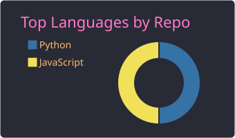
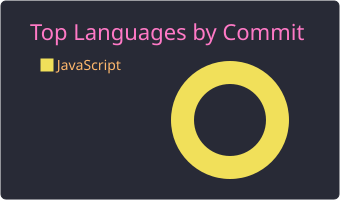
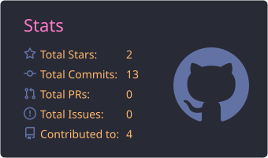

<!-- Header -->

  

  

  

---

### 👻 `$ whoami`

- 💼 IT professional with three years of experience in data engineering, data science, data analysis, and requirements analysis
- 🏛️ Delivered solutions for public-sector clients, from requirements gathering through production
- 🤖 Built data pipelines, dashboards, and OCR solutions with Python, SQL, and machine learning
- 🛡️ Focused on cybersecurity: defensive operations today, offensive security as the goal
- 📍 Brasília, Brazil

### 🔮 `$ cat current_focus.txt`

| Track | Progress |
|---|---|
| 🐧 [OverTheWire Bandit](https://github.com/PaoloJotaDotExe/bandit-journey) |  |
| 🎓 Google Cybersecurity Professional Certificate |  |
| 🌐 Networking fundamentals (TCP/IP, DNS, HTTP) |  |

### 🗂️ `$ ls ~/projects`

| Project | Description |
|---|---|
| 🐧 [**bandit-journey**](https://github.com/PaoloJotaDotExe/bandit-journey) | OverTheWire Bandit writeups: approach, failed attempts, and lessons learned. Spoiler-free, no passwords published. |
| 🛡️ [**cybersecurity-journey**](https://github.com/PaoloJotaDotExe/cybersecurity-journey) | Public log of my security studies and Google Cybersecurity Certificate portfolio activities. |

### 🧪 `$ tools --list`

  
  
  
  
  
  
  

### 📊 `$ stats --languages`

  
  

  

### 🐍 `$ git log --graph`

  <picture>
    <source media="(prefers-color-scheme: dark)" srcset="https://raw.githubusercontent.com/PaoloJotaDotExe/PaoloJotaDotExe/output/github-snake-dark.svg" />
    
  </picture>

<!-- Footer -->

  

Gengar sprite © Nintendo / Game Freak, via <a href="https://github.com/PokeAPI/sprites">PokeAPI</a>. Pixel ghosts, header, and footer are original art.
