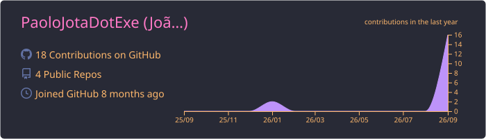

<!-- Header -->

  

  

  

---

### 👻 `$ whoami`

- 🎓 Computer Science undergraduate, based in Brasília, Brazil
- 💼 Three years of IT experience as a requirements analyst, data engineer, data scientist, and data analyst on public-sector projects
- 🛡️ Building a foundation in cybersecurity, starting with defense and working toward penetration testing
- 📝 I document everything I learn, including the attempts that failed

### 🔮 `$ cat currently_learning.txt`

| Track | Progress |
|---|---|
| 🐧 [OverTheWire Bandit](https://github.com/PaoloJotaDotExe/bandit-journey) |  |
| 🎓 Google Cybersecurity Professional Certificate |  |
| 🌐 Networking fundamentals (TCP/IP, DNS, HTTP) |  |

### 🗂️ `$ ls ~/projects`

| Project | Description |
|---|---|
| 🐧 [**bandit-journey**](https://github.com/PaoloJotaDotExe/bandit-journey) | OverTheWire Bandit writeups: approach, failed attempts, and lessons learned. Spoiler-free, no passwords published. |
| 🛡️ [**cybersecurity-journey**](https://github.com/PaoloJotaDotExe/cybersecurity-journey) | Public log of my security studies and Google Cybersecurity Certificate portfolio activities. |

### 🧪 `$ tools --list`

  
  
  
  
  
  
  

### 📊 `$ stats --all`

  

  
  

  

### 🐍 `$ git log --graph`

  <picture>
    <source media="(prefers-color-scheme: dark)" srcset="https://raw.githubusercontent.com/PaoloJotaDotExe/PaoloJotaDotExe/output/github-snake-dark.svg" />
    
  </picture>

<!-- Footer -->

  

Gengar sprite © Nintendo / Game Freak, via <a href="https://github.com/PokeAPI/sprites">PokeAPI</a>. Pixel ghosts are original art.
