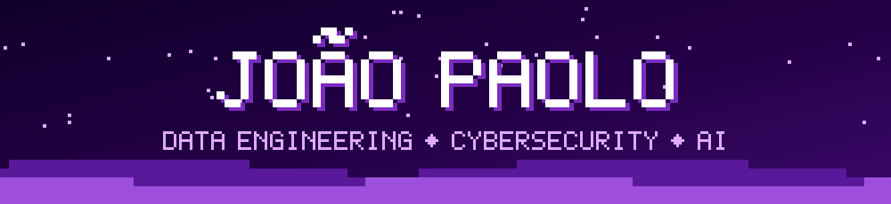
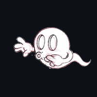
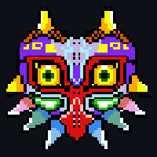
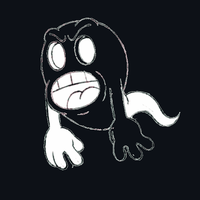

<!-- Header -->

  

<!-- neofetch card: rebuilt daily by .github/workflows/card.yml -->

  

  
  
  

### 🗂️ `joao@paolo:~$ ls ~/projects`

| Project | Description |
|---|---|
| 🧠 [**vert-trainee-data-science**](https://github.com/PaoloJotaDotExe/vert-trainee-data-science) | Group ML, NLP, optimization and EDA projects from the Vert 2024 data trainee program, mentored by Thiago Russo. MNIST 97.6%, Penguins 98%, Obesity 97.6%, Breast cancer 96.7%, all re-verified. |
| 🐧 [**bandit-journey**](https://github.com/PaoloJotaDotExe/bandit-journey) | OverTheWire Bandit writeups: approach, failed attempts, and lessons learned. Spoiler-free, no passwords published. |
| 🛡️ [**cybersecurity-journey**](https://github.com/PaoloJotaDotExe/cybersecurity-journey) | Security studies log and Google Cybersecurity Certificate portfolio activities. |

> 🔒 Most of my professional work at Vert (2023–2026) lives in the company's private repositories and is covered by confidentiality agreements, so it can't be published here. This profile brings together my public, study, and portfolio work.

### 🐍 `joao@paolo:~$ git log --graph`

  <picture>
    <source media="(prefers-color-scheme: dark)" srcset="https://raw.githubusercontent.com/PaoloJotaDotExe/PaoloJotaDotExe/output/github-snake-dark.svg" />
    
  </picture>

<!-- Footer -->

  

Header and footer pixel art are original. Majora's Mask © Nintendo (fan pixel art); ghost animations belong to their original artists.
